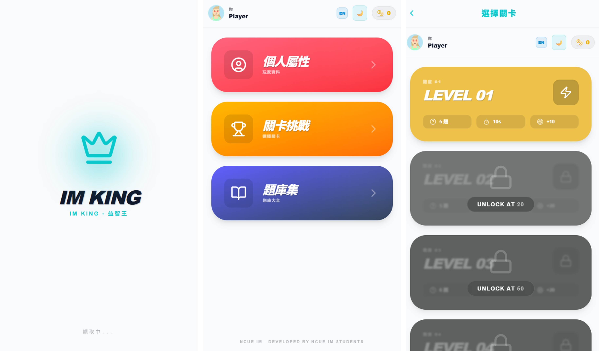

# 👑 IM King - 益智王

這是一款專為 NCUE IM (彰化師範大學資訊管理學系) 學生設計的現代化益智問答遊戲。結合了動態難度調整、角色成長系統與現代化的網頁設計技術，提供流暢且具挑戰性的遊戲體驗。


🎉 **試玩看看吧**
立即體驗這款趣味十足的益智問答遊戲！👉 [立即試玩](https://tony8382.github.io/im-king/)  


## 🌟 遊戲特色

### 1. 現代化視覺體驗 (Premium UI/UX)
- **3D 擬真卡片設計**：採用 CSS 3D Transforms 與動態陰影，營造精緻的立體感。
- **動態主題 (Dark Mode)**：完整支援深色模式，介面配色會隨系統或用戶設定自動切換，提供舒適的視覺體驗。
- **流暢動畫**：使用 `framer-motion` 實現平滑的轉場與互動反饋。
- **動態頭像**：整合 Dicebear API，根據玩家名稱生成獨一無二的像素風格頭像。

### 2. 深度遊戲機制
- **動態難度 AI**：
  - 對手不僅僅是裝飾，具備動態反應時間與答題準確率。
  - 隨著關卡提升，AI 回答速度更快、準確率更高。
- **關卡解鎖系統**：共有 8 個難度級別，需累積足夠積分才能解鎖更高難度的挑戰。
- **題庫收藏系統**：
  - **解鎖機制**：只有在遊戲中遇到過的題目才會被收錄進題庫。
  - **搜尋功能**：支持關鍵字搜尋，方便複習與查找特定知識點。
- **積分經濟**：勝利獲得積分，失敗扣除積分，積分直接影響關卡解鎖權限。

### 3. 多重感官回饋
- **Web Audio API 音效**：內建合成音效（答對、答錯、勝利、失敗），無需加載額外音訊檔，反應即時且檔案輕量。
- **震動反饋**：(行動裝置支援時) 提供觸覺回饋。

## 🛠 技術架構

本專案採用最新的前端技術棧構建，確保效能與可維護性：

- **核心框架**：[Next.js 16](https://nextjs.org/) (App Router)
- **程式語言**：TypeScript
- **樣式系統**：Tailwind CSS (配合 CSS Variables 實現動態主題)
- **狀態管理**：React Context API + localStorage (持久化存儲)
- **動畫庫**：Framer Motion
- **圖示庫**：Lucide React
- **部署支援**：支援 PWA (Progressive Web App)，可安裝至手機桌面。

## 🚀 快速開始

1. **安裝依賴**
   ```bash
   npm install
   ```

2. **啟動開發伺服器**
   ```bash
   npm run dev
   ```

3. **建置生產版本**
   ```bash
   npm run build
   npm start
   ```

## 📂 專案結構

```
src/
├── app/                 # Next.js 頁面路由
│   ├── challenge/       # 關卡選擇頁
│   ├── home/            # 主選單
│   ├── library/         # 題庫頁
│   ├── profile/         # 個人資料頁
│   └── quiz/       # 遊戲對戰室
├── components/          # 共用組件 (Header, StatsProvider)
├── data/                # 靜態資料 (questions.json)
├── lib/                 # 工具函式庫 (constants, i18n, audio)
└── ...
```

## 🤝 貢獻與開發

由 NCUE IM 學生開發。歡迎提交 Pull Request 或 Issue 來改善遊戲體驗。

---
*Developed with ❤️ by NCUE IM Students*
